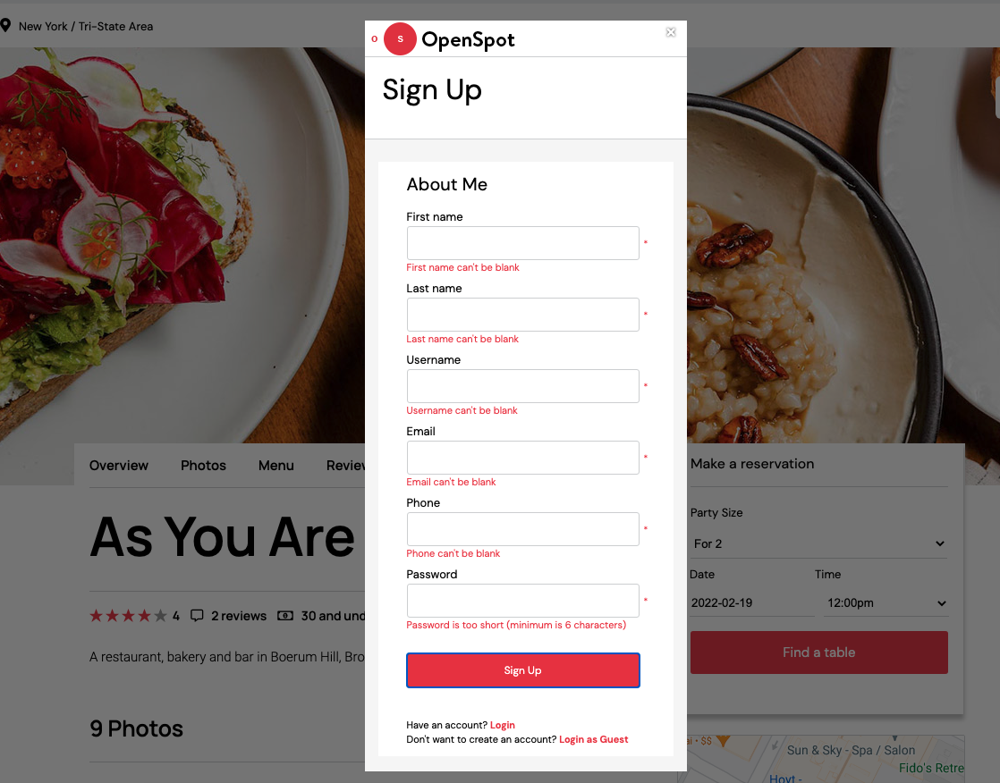
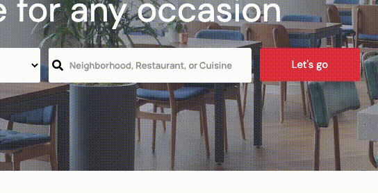
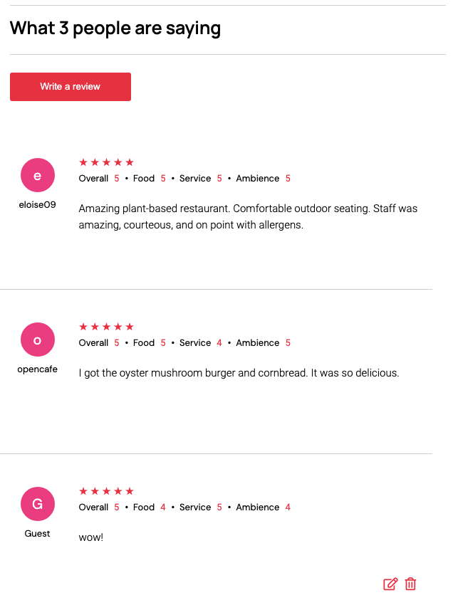
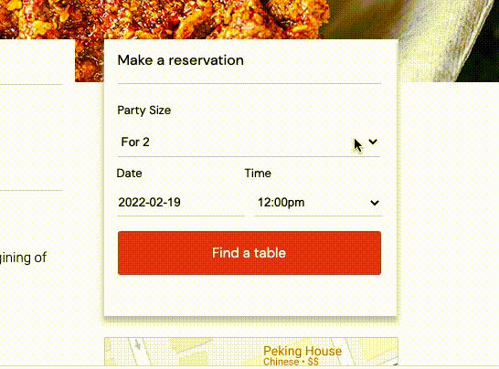
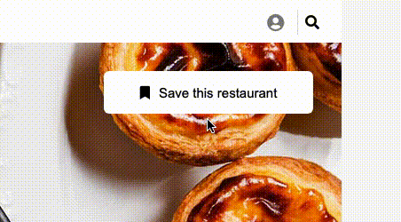

# OpenSpot

OpenSpot is a full-stack OpenTable clone where users can search, make reservations, and write reviews for dining spots across New York City.


## Technologies
- React
- Redux
- JavaScript
- Ruby on Rails
- AWS S3
- Google Map API
- PostgreSQL
- Webpack

## Features

### User Authentication
- User authentication is implemented on both frontend and backend. Presence validations and uniqueness contraints (for username and email) are enforced in models and database. Upon a successful signup, the password is hashed using BCrypt and saved to the database as a password digest.
- Users can sign up, update their account info, log in, and log out of their accounts; they will stay logged in after leaving the page.
- Error messages are displayed next to the respective fields in the signup form as part of frontend error-handling.



## Autocomplete Search Function
- OpenSpot comes with a modular search bar component with autocomplete suggestions on the main page, as a popup, and on the search index page. 
- Searches are sent to the backend and processed through Active Record queries. 



## Reviews CRUD
- A restaurant review is viewable by the public but can only be edited and deleted by its author.
- Frontend and backend user authentication are utilized to cater to a more customized experience for logged-in users, who can view, edit, and delete their own reviews in their profile and on the restaurant's page.



## Reservation CRUD
- Logged-in users can choose available time slots and make bookings directly from the homepage or on the restaurant page.
- Confirmed bookings are viewable in the user profile, with options to edit or cancel.



## Bookmark a Restaurant
- Logged-in users can bookmark any restaurants they like, with the information saved to the database and available next time they log in.



## Implementation
- Several layers of logic are used to keep the bookmark button dynamic. Depending on the user's logged-in status, it will either ask the user to log in or check whether the restaurant id is already in the user's 'favorites' slice of state in Redux. If there is a current user, it will toggle between creating and deleting the user-restaurant record in the 'favorites' table on the backend.

```js
//rest_show.jsx
        const { currentUser, favorites, removeFavorite, addFavorite, openModal } = this.props;

        const favRestIdx = {};
        favorites.map(favorite => favRestIdx[favorite.rest_id] = favorite.id);

        const restaurant = this.props.match.params.restId;
        let bookmarkAction;
        let bookmarkText = "Save this restaurant";
        let bookmarkClass = "add-fav";
        
        if (!currentUser) {
            bookmarkAction = () => openModal("login");
        } else {
            if (restaurant in favRestIdx) {
                bookmarkAction = () => removeFavorite(favRestIdx[restaurant]);
                bookmarkText = "Restaurant Saved!";
                bookmarkClass = "del-fav";
            } else {
                bookmarkAction = () => addFavorite({user_id: currentUser.id, rest_id: restaurant});
            }
        }
    // rendered output
        <button onClick={bookmarkAction} className={bookmarkClass}><i className="fas fa-bookmark"></i>{bookmarkText}</button>
```

## Future Features
- Add carousel features to restaurant list on homepage
- Show upcoming and past bookings as a dropdown alert in the navbar
- Add filter functionality to search results

## Image Credits

- All images belong to the respective restaurants unless otherwise specified.
- Al Badawi header (Adam Friedlander, Eater NY)
- Aldama header (Adam Friedlander, Eater NY)
- Angel Indian Restaurant header (James Park, Eater NY)
- Anything At All header and homepage search banner (Steve Freihon, Graduate Hotel)
- As You Are header (Alex Staniloff, Eater NY)
- Bar Blondeau header (Liz Clayman)
- Boulud Sud header (Evan Sung, Dinex Group)
- Cadence header (Eric Medsker, Cadence)
- CheLi header (An Rong Xu, New Yorker)
- Dhamaka header (Adam Friedlander, Eater NY)
- Pecking House header (David A Lee)
- Soothr search thumbnail (Timeout)
