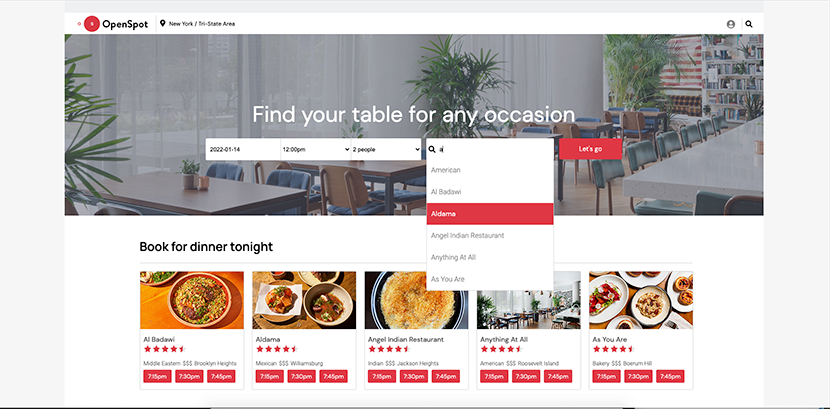

# Open Spot

Open Spot is an Open Table clone where users can search, make reservations, and write reviews for dining spots across New York City.

[Live Demo](http://openspot-aa.herokuapp.com/)

## Homepage


## Restaurant Profile


## User Reviews 


## Autocomplete Search Function 


## Technology
- React/Redux
- Javascript
- Ruby on Rails
- AWS S3
- Google Map API
- PostgreSQL

## MVP

### Splash/User Authentication
- While everyone can search for and view restaurant pages, only logged-in users can make reservations or write reviews.
- Users can sign up, update their account info, log in, and log out of their accounts.
- Users have the option to log in with a demo account to access all site functionalities.

### Search Function
- The site comes with a search bar with autocomplete suggestions for cuisine, neighborhood, and restaurant name.

### Reservation
- Logged in users can choose available time slots and make bookings from the homepage, on the restaurant profile, as well as from the popup search bar.
- Confirmed bookings are viewable in the user profile. Users have the option to edit or cancel their reservations.

### Review
- Reviews of a restaurant are viewable by the public
- Logged-in users can write a review
- Users can view, edit, and delete their own reviews in their profile

## Implementation
- As the user navigates the site, the tentative reservation redux state continously updates its info like date, time, restaurant, based on which buttons the user clicks. 

```js
//rest_index_item.jsx

      handleClick(e){
        e.stopPropagation();
        if (this.props.currentUser) {
            this.props.fillInOneFieldBooking("rest_id", this.props.rest.id);
            this.props.fillInOneFieldBooking("user_id", this.props.currentUser.id);
            this.props.fillInOneFieldBooking("time", e.target.innerText.slice(0, 4));
        } else {
            this.props.openModal("login");
        }
    }

    render(){
        const { rest } = this.props;

        if (rest.photos.length === 0) return null; 
        const image = rest.photos[0].url;
        const whereTo = this.props.currentUser ? "/booking" : "/";
        return (
            <li className="rest-index-thumbnail">
                <Link to={`rests/${rest.id}`}>
                
                <div className="thumbnail-text">
                    <h1>{rest.name}</h1>
                    <div className="stars"></div>
                    <div className="thumbnail-detail">
                        <span>{rest.cuisine}</span>
                        <div className="price">$$$</div>
                        <span>{rest.neighborhood}</span>
                    </div>
                </div>
                </Link>
                <div className="button-row">
                <Link to={whereTo} onClick={this.handleClick}><button className="thumbnail-button">7:15pm</button></Link>
                <Link to={whereTo} onClick={this.handleClick}><button className="thumbnail-button">7:30pm</button></Link>
                <Link to={whereTo} onClick={this.handleClick}><button className="thumbnail-button">7:45pm</button></Link>
                </div>
            </li>
            
        )
    }
```


## Future Features
- Allow users to bookmark favorite restaurants 
- Add carousel features to restaurant list on homepage
- Make available booking time more dynamic based on users' search
- Show restaurant ratings based on average of user ratings
- Show upcoming and past bookings as a dropdown alert in the navbar
- Add filter functionality to search results